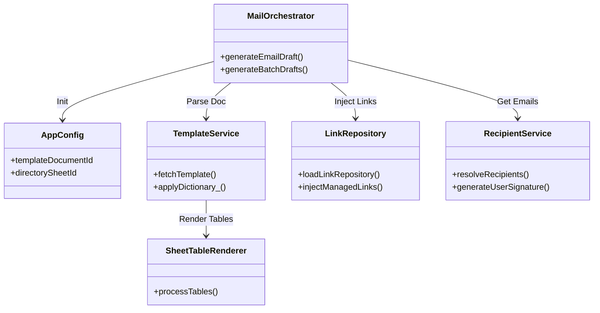
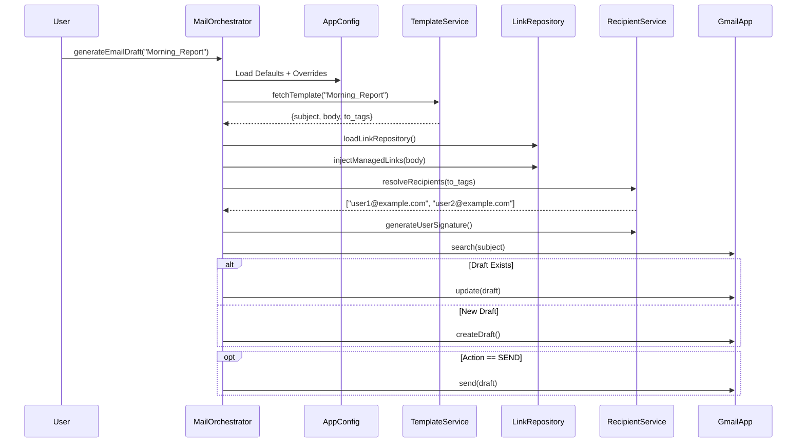

# Architecture Overview

## System Context

The **Google Workspace Email Orchestrator** is a script-based automation tool that runs within the Google Apps Script environment. It bridges the gap between unstructured content (Docs) and structured data (Sheets) to produce formatted emails (Gmail).

## Module Structure

The codebase is split into small modules, each responsible for one part of the workflow:

## Data Flow Pipeline

The system follows a linear pipeline pattern for each execution:

## Component Breakdown

### 1. AppConfig (Configuration)
A central configuration layer that stores environment IDs (Docs, Sheets) and supports runtime overrides for testing and development. (Doc IDs, Sheet IDs). It supports runtime overrides, allowing the script to switch between "Test" and "Production" resources dynamically.

### 2. MailOrchestrator (Core Logic)
- The main controller. It coordinates the data flow and handles "fail-fast" logic.
-   **LockService**: Designed to support locking via LockService to prevent concurrent executions when triggered automatically.
-   **Draft Recycling**: Searches for existing drafts matches by subject to avoid clutter.
-   **Send vs Draft**: Configurable final action (`emailAction`) to either leave as draft or send immediately.

### 3. TemplateService (Parsing)
Extracts content from Google Docs.
-   **Dictionary Engine**: Replaces `{{KEY}}` tags with dynamic values.
-   **HTML Conversion**: Converts Google Doc content into HTML suitable for Gmail drafts..
 
### 4. SheetTableRenderer (Visualization)
A dedicated renderer that converts Google Sheet ranges into HTML tables.
-   **Formatting**: Attempts to preserve key formatting such as background colors, fonts, and borders.
-   **Merges**: accurately handles `rowspan` and `colspan`.

## Reliability Patterns

### Concurrency Safety
- The design anticipates concurrent trigger execution and is intended to use LockService to avoid duplicate runs.

### Quota Management
-   **Batch Handling**: The `generateBatchDrafts` function includes a timer to stop execution before the 6-minute Apps Script limit is reached.
-   **CacheService**: Used to reduce repeated Drive calls when generating signatures or loading shared assets.

## Deployment Model

This project is architected to be deployed as a **Google Apps Script Library**.

-   **Library Mode**: The script is deployed once and typically has a fixed `HEAD` version or numbered versions.
-   **Consumption**: Other scripts (e.g., container-bound scripts in specific Spreadsheets) add this project as a library.
-   **Config Separation**: Configuration (`AppConfig`) is passed from the *consumer* script to the *library*, ensuring the core logic remains stateless and reusable across different departments or teams.

## Platform Constraints

This system is built within the boundaries of the Google Apps Script runtime:

1.  **Execution Time**: Scripts have a hard limit (usually 6 minutes per execution). The Batch Orchestrator mitigates this, but large batches (>50 drafts) may need to be split.
2.  **Email Quotas**: Google Workspace accounts have daily sending limits (e.g., 2,000 emails/day for Enterprise). This tool is for *internal* operations, not mass marketing.
3.  **HTML Support**: Gmail's rendering engine has specific quirks. This tool focuses on "table-safe" HTML to ensure consistent rendering across devices.

## Security & Privacy

-The script runs entirely within the user’s Google Workspace environment.
No external servers or third-party APIs are used.
Access is controlled through standard Google OAuth scopes granted during installation.

## Trade-offs

This project prioritizes simplicity and adoption inside Google Workspace over full email-platform flexibility.

Key trade-offs:
- Built on Apps Script → constrained by execution time and quotas
- Uses Google Docs as templates → easier for non-developers, but less precise than hand-written HTML
